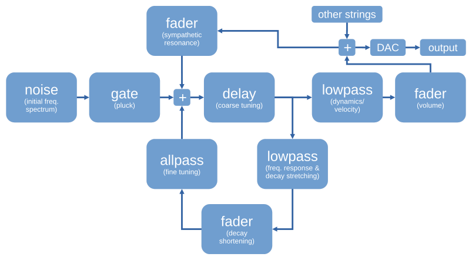

# Karplus-Strong Guitar

Physically modeled guitar strings using the Karplus-Strong algorithm with some extensions by Jaffe & Smith.

The string model is built from primitive digital filters like white noise, delay, fader, lowpass & allpass connected
by patch cables that form a feedback loop. The patch configuration is described in `ks_string.v`.  Individual filters
are implemented in `ks_noise.v`, `ks_delay_*.v`, `ks_fader.v`, `ks_feedback.v`, `ks_tuning.v` and `ks_dynamics.v`.
You may wish to follow the original articles for more details:
* Karplus, K. and Strong, A., 1983. Digital synthesis of plucked-string and drum timbres. Computer Music Journal, 7(2), pp.43-55.
* Jaffe, D.A. and Smith, J.O., 1983. Extensions of the Karplus-Strong plucked-string algorithm. Computer Music Journal, 7(2), pp.56-69.

Strings can be set up, tuned, plucked or muted via the wishbone bus. The default build contains a single string,
but it can be reconfigured for multiple strings with sympathetic resonsances by editing `defines.v`.

Being a fully digital design audio is output via the I2S protocol, so you'll need a DAC chip ("soundcard") such as
CS4344, UDA1334A or MAX98357A to get analog output.
